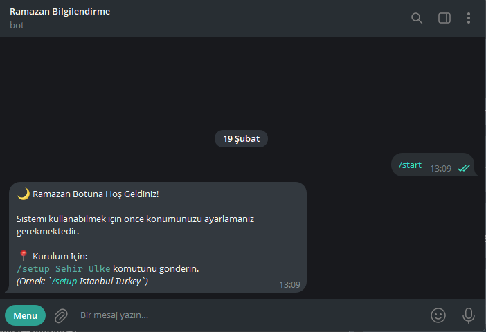
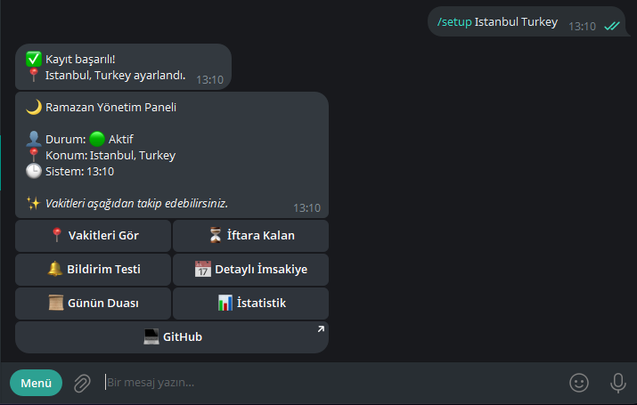
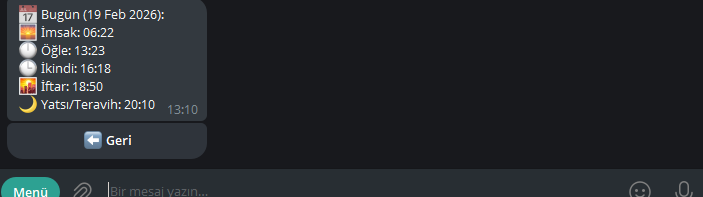
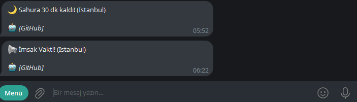

# 🌙 Ramazan Vakitleri Telegram Botu


<p align="center">
  
  <br>
  <i>Ramazan ayında iftar ve sahur vakitlerini cebinize getiren hızlı çözüm.</i>
</p>

---

## ⚠️ Disclaimer (Sorumluluk Reddi)

> [!IMPORTANT]
> Bu bot tarafından sağlanan veriler üçüncü taraf API(lar) (Aladhan API vb.) üzerinden çekilmektedir. Verilerin doğruluğu konusunda %100 garanti verilmemektedir. Oluşabilecek teknik aksaklıklardan veya veri gecikmelerinden dolayı sorumluluk kullanıcıya aittir. İbadetleriniz için resmi takvimleri de kontrol etmeniz önerilir.


## 🛠️ Proje Hakkında ve Geliştirme Notu

> [!WARNING]
> **Bu proje geliştirilme aşamasındadır.**
> Kod içerisinde eksiklikler, mantık hataları veya geliştirilmesi gereken alanlar bulunabilir. Proje tamamen **açık kaynaklıdır** ve topluluk desteğiyle daha iyi hale gelmesi hedeflenmektedir. Eğer bir hata bulursanız veya bir özellik eklemek isterseniz Pull Request göndermekten çekinmeyin!

## 🤖 Canlı Demo (Hemen Kullanın)

> [!TIP]
> Botu kendi sunucunuzda host etmekle uğraşmak istemiyorsanız, halihazırda çalışan ve aktif güncellemeler alan resmi botu kullanabilirsiniz:
>
> 🔗 **Telegram'da Aç:** [@ramadan_infobot](https://t.me/ramadan_infobot)
>
> *Bu bot sürekli güncellenmekte ve yeni özellikler eklenmektedir.*

---

## ✨ Özellikler

- 🌍 **Global Bildirim:** Dünya üzerindeki tüm şehirler için Aladhan API üzerinden güncel vakitleri çeker.
- 🔔 **Otomatik Bildirim:** Sahur ve İftar vakitlerinde kullanıcıyı veya grubu otomatik uyarır.
- 📱 **Gelişmiş Panel:** Tamamen butonlarla kontrol edilen (Inline Keyboard) kullanıcı dostu arayüz.
- 👥 **Grup Desteği:** Botu gruplara ekleyebilir ve `/setup` komutuyla gruba özel vakit bildirimleri kurabilirsiniz.
- 🔐 **Güvenli Yönetim:** Admin paneli üzerinden sistem istatistiklerini takip etme ve iki aşamalı veritabanı sıfırlama.
- 🗄️ **Kalıcı Veri:** SQLite veritabanı ile kullanıcı tercihleri bot kapansa bile silinmez.
- 📅 **Günlük İmsakiye:** Tüm vakitlerin (İmsak, Güneş, Öğle, İkindi, Akşam, Yatsı) listelenmesi.
- 📍 **Şehir Bazlı Sorgulama:** Türkiye geneli tüm iller için anlık veri.

---

## 📸 Ekran Görüntüleri

| Başlangıç Ekranı | Kullanıcı Paneli | Vakitler | Bildirim |
| :---: | :---: | :---: | :---: |
|  |  |  |  |

---

## 🛠️ Kurulum

1.  **Depoyu Klonlayın:**
    ```bash
    git clone [https://github.com/yazi-dev/ramazan-vakit-telegram-bot.git](https://github.com/yazi-dev/ramazan-vakit-telegram-bot.git)
    cd ramazan-vakit-telegram-bot
    ```

2.  **Gerekli Paketleri Yükleyin:**
    ```bash
    # Node.js:
    npm install
    ```

3.  **Bot Ayarları:**
    *🥇 `.env.example` dosyası `.env` şeklinde düzeltin.
    *🥈 `.env` dosyası içindeki `BOT_TOKEN=TOKEN_BURAYA` Telegram `Bot Father` üzerinden aldığınız bot tokenini girin.
    *🥉 `.env` dosyası içindeki `ADMIN_ID=CHAT_ID_BURAYA` kendi chat id'nizi buraya kaydedin.

4.  **Botu Başlatın:**
    ```bash
    node src/index.js
    ```

5.  **ve hazır:**
    `Botu kullanmaya başlayabilirsiniz` 
    * Botu 7/24 çalıştırmak isterseniz bir uzak masaüstü (vds) kullanmanız önerilir .

---

## 🤝 Katkıda Bulunma

Hataları bildirmek veya yeni özellik eklemek için bir **Issue** açabilir veya doğrudan **Pull Request** gönderebilirsiniz.

